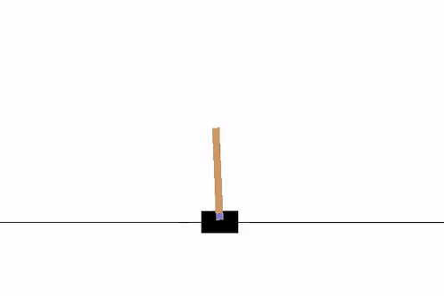

## Getting Started with Reinforcement Learning using OpenAI Gym

Minimal code example to get started with Reinforcement Learning using the
[OpenAI Gym](https://gym.openai.com/) environment.

Take a look at the code which shows basic usage of the gym environment. It
implements a policy gradient algorithm. The policy is implemented with a
fully connected neural network with a single hidden layer using
[TensorFlow](https://www.tensorflow.org/).

It learns to balance the CartPole in the gym: 

